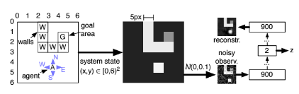
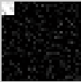
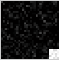

# Simple-DQN

This is a modified implementation of this paper:
[Deep Auto-Encoder Neural Networks in Reinforcement Learning](https://www.google.com.tw/url?sa=t&rct=j&q=&esrc=s&source=web&cd=1&cad=rja&uact=8&ved=0ahUKEwjD5Y2Q9O3PAhWIoJQKHfgsAykQFggdMAA&url=http%3A%2F%2Fciteseerx.ist.psu.edu%2Fviewdoc%2Fdownload%3Fdoi%3D10.1.1.172.1873%26rep%3Drep1%26type%3Dpdf&usg=AFQjCNH7-9ZJoUGz9KGpHP2WaeZ-A5KHWA&sig2=M-wtUBp9gGEvCSfzDtDOzA)

## Toolbox
Before you start, make sure you have included this toolbox in your path of Matlab
[Deeplearning Tool Box](https://github.com/rasmusbergpalm/DeepLearnToolbox)

## Run
rum_map.m

## Show
This program will find the best path from start position(left) to the goal position(right).
Instead of giving the information of f(6,6,\ast) states, we give the pixcels of whole picture as a state.
This is a 30*30 picture which contains 5*5 small white picture as a robot's position.

f(x1,x2,\ldots,xn)
